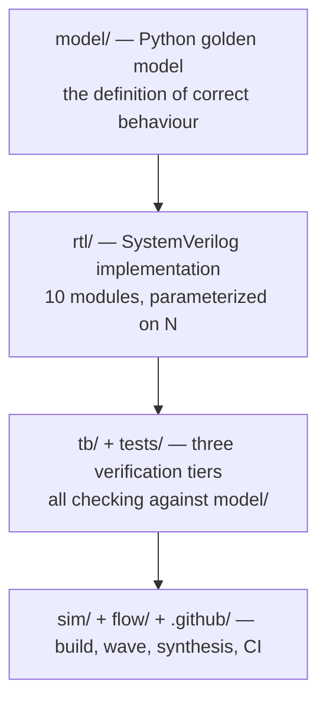
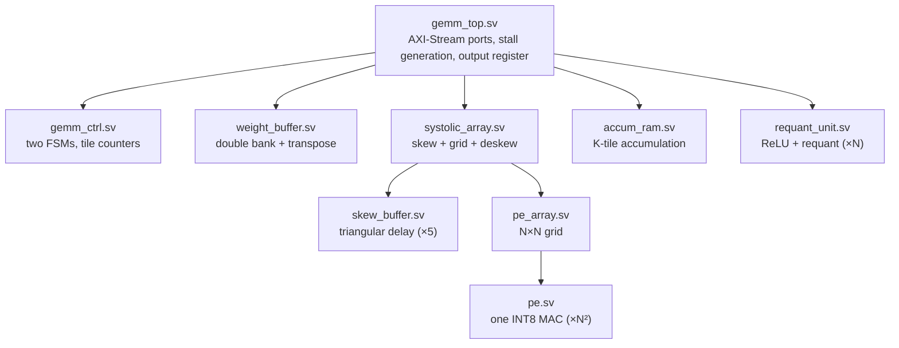
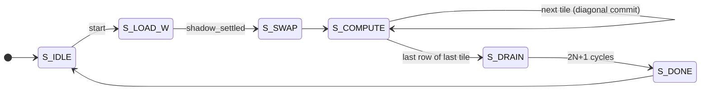
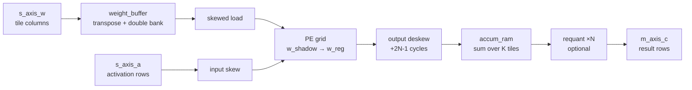
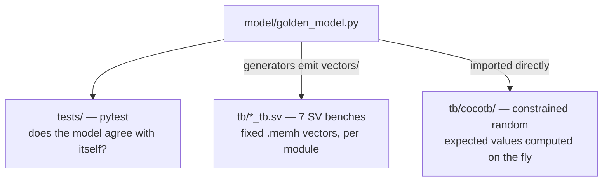

# Code Map

What every file in this repository is, how the pieces fit together, and how the
accelerator actually works. Start here if you are new to the codebase.

The other docs go deeper: [SPEC.md](SPEC.md) is the microarchitecture
specification, [CONTROL.md](CONTROL.md) walks the state machines and every
control/status signal, [DATAFLOW.md](DATAFLOW.md) the AXI-Stream layout and the
weight transpose, [PHASE2_RTL.md](PHASE2_RTL.md) the RTL implementation report,
[PHASE3_VERIFICATION.md](PHASE3_VERIFICATION.md) the verification report,
[PHASE4_PLAN.md](PHASE4_PLAN.md) the physical-design plan, and
[WAVEFORMS.md](WAVEFORMS.md) how to look at a single GEMM in GTKWave.

---

## 1. The one-paragraph version

The design computes `C = A × B` for INT8 matrices on an `N×N`
**weight-stationary systolic array**. A tile of `B` is pinned into the array's
processing elements; rows of `A` stream in from the west, partial sums flow
south, and finished rows of `C` fall out of the bottom. Matrices larger than
`N×N` are cut into tiles and streamed tile by tile, with the *next* tile's
weights preloading into shadow registers while the *current* tile computes — so
tile handover costs zero cycles. Everything is checked against a Python golden
model that is the single source of numerical truth.

The repository is four concentric layers:



---

## 2. Repository map

| Path | What it holds |
|---|---|
| `model/` | NumPy golden model and test-vector generators |
| `rtl/` | The 10 SystemVerilog modules |
| `tb/` | 7 SystemVerilog unit/integration testbenches |
| `tb/cocotb/` | Python constrained-random bench + functional coverage |
| `tests/` | pytest self-checks for the golden model itself |
| `vectors/` | Generated `.memh` stimulus/expected files (checked in) |
| `sim/` | Verilator build, waveform tooling |
| `flow/` | OpenLane/Sky130 synthesis prep (Phase 4) |
| `docs/` | Specification and phase reports |
| `.github/workflows/` | CI |

---

## 3. The RTL

### 3.1 Module hierarchy



`gemm_pkg.sv` sits outside the hierarchy — it is a package every module
references for the shared widths (`DW_IN=8`, `DW_ACC=32`, `DIM_W=16`) and the
one-hot FSM enum.

### 3.2 Module by module

| File | Lines | Role |
|---|---|---|
| `gemm_pkg.sv` | 32 | Shared parameters and the `state_e` FSM enum |
| `pe.sv` | 99 | One INT8×INT8→INT32 MAC with a stationary weight and its shadow |
| `pe_array.sv` | 69 | Wires `N²` PEs into a grid; pure grid, no skew |
| `skew_buffer.sv` | 52 | Triangular delay network — lane `i` delayed `i` or `N-1-i` cycles |
| `systolic_array.sv` | 142 | Wraps the grid in skew/deskew; clean row-in/row-out interface |
| `weight_buffer.sv` | 85 | Double-banked tile store; also the column→row **transposer** |
| `accum_ram.sv` | 99 | Accumulates the K-tile partial results for each output row |
| `requant_unit.sv` | 49 | Combinational ReLU + fixed-point INT32→INT8 |
| `gemm_ctrl.sv` | 335 | Main schedule FSM + concurrent weight-loader FSM |
| `gemm_top.sv` | 306 | AXI-Stream, stall generation, output register, `tlast` |

### 3.3 The processing element

`pe.sv` is the atom. Each cycle, when enabled:

```
a_out    <= a_in                      // activation continues east
psum_out <= psum_in + a_in * w_reg    // partial sum continues south
```

Note the multiply consumes the activation **arriving** this cycle, not the
registered one — that detail is what makes the RTL match `SystolicArraySim`
cycle for cycle.

Each PE holds two weight registers: `w_reg` (in use) and `w_shadow` (the next
tile, preloading). The shadow reaches `w_reg` by one of two commits:

- **`swap_bcast`** — every PE at once. Used only for the first tile of a pass,
  when the array holds no in-flight wavefront.
- **`swap_in`** — a token that rides the *same* skew network as the
  activations, so it reaches `PE[i][j]` on exactly the cycle that PE consumes
  the outgoing tile's last activation row. A global pulse cannot do this,
  because every PE's handoff cycle differs. This is what makes tile handover
  free.

Everything is gated by a single `en`, so a stall freezes the whole datapath
coherently — an in-flight wavefront and the weight shift chain must never move
relative to one another.

### 3.4 Skew: why the triangles exist

In a systolic array, activation row `i` must enter PE row `i` exactly `i`
cycles late so the diagonal wavefront meets the right partial sums.
`skew_buffer.sv` is that delay triangle, and `systolic_array.sv` instantiates
it **five** times:

| Instance | Width | Direction | Purpose |
|---|---|---|---|
| `u_skew_a` | `DW_IN` | ascending | delay activation row `i` by `i` |
| `u_skew_swap` | 1 | ascending | the diagonal weight-commit token |
| `u_skew_w` | `DW_IN` | ascending | delay column `j`'s weight load by `j` |
| `u_skew_wen` | 1 | ascending | the matching per-column shift enable |
| `u_deskew_c` | `DW_ACC` | descending | realign result columns onto one beat |

The weight *load* is skewed for the same reason the commit is: a globally
synchronous shift chain would overwrite `PE[i][j]`'s shadow before columns
`j ≥ 2` had committed it. Putting the load on the same diagonal as the commit
is what lets tiles overlap at `M ≥ 2N` instead of `M ≥ 3N-1`.

Result: drive one unskewed activation row per cycle, and the matching result
row appears exactly **`2N-1` cycles later**, one row per cycle thereafter.

### 3.5 Weight buffer: the transposer

An easy thing to miss. The weight stream delivers one tile **column** per beat,
but the array shifts weights *down* through its columns and so consumes one
tile **row** per cycle. `weight_buffer.sv` absorbs that mismatch — written
column-wise, read row-wise. It is the transpose.

It is double-banked because at the tightest legal schedule (`M = N`) a tile
pass is only `N` cycles long, exactly enough to overlap an `N`-cycle fill with
an `N`-cycle drain. One bank would not do.

Rows are read **descending** (`N-1` first), because the first value pushed into
a shift chain travels furthest.

### 3.6 Accumulation

The tile loop is `for nt: for kt:`, so the K tiles contributing to one output
column-block arrive as a sequence of partial results for the same `M` rows.
`accum_ram.sv` read-modify-accumulates them across a two-stage pipeline, so it
maps onto a plain synchronous-read RAM rather than a register file.

Which tile a row belongs to travels **with the row** as a 2-bit tag
(`a_tag = {kt==0, kt==kt_max}`) through the array's pipeline, emerging as
`in_first` / `in_last`. The accumulator therefore never needs to know the
pipeline depth, and stays correct once tiles overlap.

The adds are **lane-wise**, deliberately not one wide addition — a carry out of
lane `j` would corrupt lane `j+1`.

### 3.7 Control

`gemm_ctrl.sv` runs two cooperating state machines:



- **Main FSM** streams `M` activation rows per tile, back to back across tiles.
- **Loader FSM** (`WL_IDLE → WL_SHIFT → WL_SETTLE`) independently pulls the
  next tile out of the weight buffer and shifts it into the shadows *while the
  current tile computes*. The handshake between them is a single flag,
  `shadow_ready`.

Only the first tile uses the broadcast commit (`S_LOAD_W`/`S_SWAP`, array
empty). Every later tile commits diagonally from within `S_COMPUTE`, which is
why the state diagram loops there rather than returning to `S_LOAD_W`.

Both FSMs are one-hot encoded, so the "FSM is one-hot" assertion is a direct
property of the encoding rather than a separate claim.

### 3.8 Top level: stalls and streams

`gemm_top.sv` wires it together and owns three things the submodules do not:

**Stall generation.** One `core_en` gates the entire datapath:

```
in_starved  = activation wanted but absent
out_blocked = result offered but the output register is full
core_en     = !in_starved && !out_blocked
```

The weight *fill* path is deliberately **outside** `core_en` — weights for the
next tile must keep arriving while the core is stalled, which is the whole
point of the double bank. Only the bank swap is gated.

**The output register.** A one-deep register decouples `m_axis_c` from
`core_en`. Without it, a core stalled for want of an activation would freeze
the accumulator with `out_valid` still high, and a ready consumer would accept
the same row every stalled cycle. Deasserting `tvalid` is not allowed —
AXI-Stream requires it to stay up once raised.

**`tlast`.** Counted as rows *leave* the accumulator, not read from the FSM's
current tile, so it stays correct however far the output trails the schedule.

### 3.9 How one GEMM executes



1. `start` latches `M`, `K`, `N`. The FSM enters `S_LOAD_W`.
2. Weight columns stream in; the buffer transposes them and fills a bank.
3. The loader shifts `N` rows down into the shadows, skewed by column.
4. `S_SWAP` broadcasts the commit — the first tile only.
5. `S_COMPUTE` streams `M` activation rows. Results emerge `2N-1` cycles later
   and accumulate by K tile. On the last row of each tile, `swap_row` sends the
   diagonal commit and the next tile begins with no gap.
6. `S_DRAIN` waits `2N+1` cycles for the pipeline to empty, then `S_DONE`
   pulses `done`.

Steady-state cost is one result row per cycle. Overhead beyond that is
*constant in the number of tiles* when `M ≥ 2N` — 27 cycles at 4×4, 47 at 8×8.

---

## 4. The golden model

`model/golden_model.py` (195 lines) is the single source of truth. Four pieces:

| Symbol | What it defines |
|---|---|
| `gemm_int8(a, b)` | Functional reference with exact INT32 accumulation |
| `requantize(acc, mult, shift)` | The INT8 output stage, bit-exact |
| `SystolicArraySim` | A **cycle-level** simulator of the skewed schedule |
| `gemm_int8_tiled(a, b, n)` | The full multi-tile schedule the FSM implements |

`SystolicArraySim` is the interesting one: it models *when* each result
emerges, not just its value. `tb/systolic_array_tb.sv` checks RTL result
ordering against that emergence log rather than against a hand-derived latency
formula — so wrong ordering fails even when every value is right.

Three generators emit `.memh` vectors into `vectors/`, one per verification
tier: `generate_vectors.py` (end-to-end), `generate_array_vectors.py`
(array-level), `generate_requant_vectors.py` (output stage). The docstring of
`generate_vectors.py` is the authoritative statement of AXI-Stream **beat
order**, which the RTL, the vectors and the cocotb bench all have to agree on.

---

## 5. Verification

Three tiers, all pointing at the same golden model.



**Tier 1 — `tests/test_golden_model.py`.** Self-checks on the model: does
`SystolicArraySim` agree with `gemm_int8`, does tiling agree with the flat
version, does the overflow bound hold.

**Tier 2 — `tb/*_tb.sv`.** One testbench per module, run by `sim/Makefile`
under Verilator. Fixed `.memh` vectors from `vectors/`. These are the tests
that pin down module-level behaviour (`pe_tb`, `skew_buffer_tb`,
`weight_buffer_tb`, `accum_ram_tb`, `requant_unit_tb`), plus two integration
benches (`systolic_array_tb`, `gemm_top_tb`).

**Tier 3 — `tb/cocotb/`.** The constrained-random layer:

| File | Role |
|---|---|
| `run.py` | Builds N=4 and N=8, runs both, merges coverage, enforces closure |
| `test_gemm_top.py` | 7 directed corner tests + a constrained-random test, plus a waveform helper skipped in normal sessions |
| `axis.py` | AXI-Stream master/slave BFMs with bursty stall injection |
| `coverage.py` | Functional coverage model, merge, and closure report |

The decisive difference from tier 2: there are **no pre-generated vectors**.
Each run draws dimensions, matrices, stall profile and quantization constants,
computes the expectation by calling the golden model directly, and checks every
beat. Coverage bins map one-to-one onto this design's known failure modes, and
the session **fails if any mandatory bin is unhit**.

Assertions (`SIM_ASSERT`) are compiled into every tier: accumulator overflow in
`pe.sv`, bank-swap safety in `weight_buffer.sv`, AXI-Stream stability and FSM
legality in `gemm_top.sv` / `gemm_ctrl.sv`.

---

## 6. Build, waves, and physical design

| File | Role |
|---|---|
| `sim/Makefile` | Verilator build; `make`, `make lint`, `make top STALL=30 QUANT=1` |
| `sim/tb_waivers.vlt` | Verilator lint waivers scoped to the testbenches |
| `sim/wave.sh` | Run one small GEMM with tracing and open GTKWave |
| `sim/waves/gen_gtkw.py` | Generate a GTKWave save file with correct bit ranges |
| `flow/Makefile` | `make audit` — yosys parse + memory-inference gate |
| `flow/openlane/config.json` | OpenLane 2 configuration for the 8×8 tape-out |
| `flow/openlane/constraints.sdc` | Timing constraints |
| `flow/scripts/collect.py` | Tabulate PPA metrics across OpenLane runs |
| `.github/workflows/ci.yml` | Two jobs: golden model, then full RTL verification |

### The yosys constraint

Worth knowing before you edit RTL. OpenLane runs **mainline yosys**, which
cannot parse multidimensional packed arrays or wildcard package imports. The
RTL is therefore written with:

- **flat lane vectors** — lane `i` at bits `[i*DW +: DW]`, not `[N-1:0][DW-1:0]`
- **fully qualified package references** — `gemm_pkg::DW_IN`, never `import
  gemm_pkg::*`

`make -C flow audit` is the gate that keeps it that way, and CI runs it on
every push. The audit also asserts that `accum_ram` still infers as a memory
(`$mem_v2`) — a demotion to registers means an RTL change broke the
synchronous read-modify-write pattern.

---

## 7. The contracts that tie files together

The couplings that are not visible from any single file:

| Contract | Enforced across |
|---|---|
| **Beat ordering** — weights by column, activations by row, re-streamed per column-block | `generate_vectors.py` docstring → `weight_buffer.sv` transpose → cocotb `w_beat_list`/`a_beat_list` |
| **Bit-exact requantization** — round-half-up, `shift=0` adds no rounding term | `golden_model.requantize()` ↔ `requant_unit.sv` |
| **Cycle-level timing** — result row `r` emerges at `r + 2N-1` | `SystolicArraySim` ↔ `systolic_array.sv` ↔ `systolic_array_tb.sv` |
| **Overflow bound** — `K ≤ 2¹⁷` | `K_MAX_NO_OVERFLOW` in both `golden_model.py` and `gemm_pkg.sv`, asserted in `pe.sv` |
| **Weight row order** — descending, `N-1` first | `weight_buffer.sv` `rd_row` ↔ `pe_array.sv` shift direction |
| **Synthesizability** — flat vectors, qualified package refs | all of `rtl/` ↔ `flow/Makefile` audit ↔ CI |
| **Dimension legality** — `N` a power of two; `K`, `N` multiples of it | `gemm_ctrl.sv` SVA ↔ cocotb `run_gemm` ↔ `sim/wave.sh` guard |

## 8. Where to start reading

- **Understand the algorithm** → `model/golden_model.py`, then `docs/SPEC.md`
- **Understand the hardware** → `rtl/pe.sv` → `systolic_array.sv` →
  `gemm_top.sv` (each has a substantial header comment)
- **Understand the schedule** → `rtl/gemm_ctrl.sv` header, then §3.7 above
- **See it run** → `sim/wave.sh` and [WAVEFORMS.md](WAVEFORMS.md)
- **Change something** → run `make -C sim`, `python tb/cocotb/run.py`, and
  `make -C flow audit` before pushing
