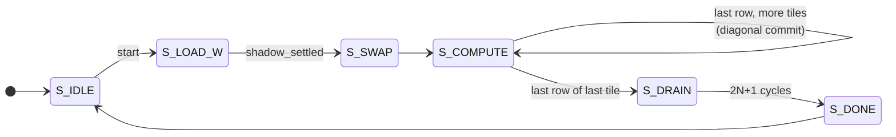
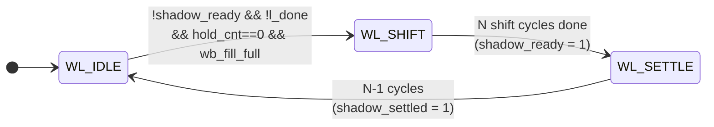

# Control and Streaming Interfaces

The two state machines, every control and status signal and the module it
connects to, and how data gets in and out over AXI-Stream.

Companion to [CODE_MAP.md](CODE_MAP.md) (what every file is),
[DATAFLOW.md](DATAFLOW.md) (stream layout and the weight transpose) and
[SPEC.md](SPEC.md) (the microarchitecture specification). Everything here is
read out of `rtl/gemm_ctrl.sv` and `rtl/gemm_top.sv`.

---

## 1. The two state machines

Both live in `rtl/gemm_ctrl.sv`, in the **same** `always_ff` block
(`gemm_ctrl.sv:138`), and both are gated by `core_en` — on a stall every state
register, counter and flag freezes together. Reset is asynchronous, active-low.

### 1.1 Main schedule FSM — `state` (`gemm_pkg::state_e`, 6-bit one-hot)

Encoding at `gemm_pkg.sv:23`. It walks the tile loop `for nt: for kt:`.



| State | Entered when | What it does | Exits on |
|---|---|---|---|
| `S_IDLE` | reset, or after `S_DONE` | idle; `busy = 0` | `start` → `S_LOAD_W` |
| `S_LOAD_W` | `start` latched `cfg_m/k/n` into `m_q/k_q/n_q`, cleared `kt/nt/l_kt/l_nt/row_cnt/wl_*`, `busy <= 1` | waits for the **loader FSM** to fully settle the first tile into the shadows | `shadow_settled` → `S_SWAP` |
| `S_SWAP` | — | exactly one cycle. Asserts `swap_bcast`, clears `shadow_ready`/`shadow_settled` (releasing the loader for tile 1), `row_cnt <= 0` | unconditional → `S_COMPUTE` |
| `S_COMPUTE` | — | streams `M` activation rows per tile, back to back across tiles. `row_cnt++` on every `a_fire` | last row of last tile → `S_DRAIN`; last row of any other tile → stays in `S_COMPUTE` with the tile counters advanced |
| `S_DRAIN` | — | counts `DRAIN_CYC = 2N+1` cycles (`2N-1` pipeline latency + 2 accumulator stages) | `drain_cnt == 2N` → `S_DONE` |
| `S_DONE` | — | `busy <= 0`, `done <= 1` | unconditional → `S_IDLE` |

`S_COMPUTE` loops on itself rather than returning to `S_LOAD_W` because only
the **first** tile of a GEMM uses the broadcast commit. Every later tile commits
diagonally from inside `S_COMPUTE` (`gemm_ctrl.sv:240-263`):

```systemverilog
if (last_row && !last_tile) begin
  shadow_ready <= 0; shadow_settled <= 0;   // re-arm the loader
  row_cnt      <= 0;
  hold_cnt     <= N-2;                      // no-clobber guard
  // kt/nt advance
end
```

`S_LOAD_W` and `S_SWAP` are two states because the commit needs its own cycle:
it can be neither on the last shift cycle (the shadow register is still being
written on that edge) nor on the first compute cycle (`PE[0][0]` sees a
zero-skew activation and would consume it against the *outgoing* weight).

### 1.2 Weight-loader FSM — `wl_state` (3-bit one-hot)

Declared locally at `gemm_ctrl.sv:90`. Runs **concurrently** with the main FSM.
Its job is to pull the next tile out of the weight buffer and shift it into the
PE shadow registers while the current tile is still computing.



| State | Condition to leave | Actions |
|---|---|---|
| `WL_IDLE` | `!shadow_ready && !l_done && hold_cnt == 0 && wb_fill_full` | asserts `wb_bank_swap` **combinationally in this same cycle** (`gemm_ctrl.sv:125`), so the buffer presents the new drain bank from the next cycle — which is the first `w_shift_en` cycle. `wl_cnt <= 0` → `WL_SHIFT` |
| `WL_SHIFT` | `wl_cnt == N-1` | `w_shift_en` high for `N` cycles; `wb_rd_row = N-1-wl_cnt` (descending). At the end: `shadow_ready <= 1`, and the *loader's own* tile pointers `l_kt`/`l_nt` advance, or `l_done <= 1` on the last tile |
| `WL_SETTLE` | `wl_cnt == N-2` | waits `N-1` cycles for the skewed load to reach the last column, then `shadow_settled <= 1` → `WL_IDLE` |

### 1.3 The handshake between the two FSMs

Three flags, and that is the whole protocol:

- **`shadow_ready`** — set by the loader after `N` shift cycles. Enough for a
  *diagonal* commit, because the commit's per-column deadline moves with the
  same skew as the load. Cleared by the main FSM at each tile boundary and at
  `S_SWAP`.
- **`shadow_settled`** — set only after `WL_SETTLE`. Required for the
  *broadcast* commit, which has no skew to hide behind and so must wait for the
  last column. Only `S_LOAD_W` consumes it.
- **`hold_cnt`** (loaded with `N-2` at each tile handover) — blocks the *next*
  shift until the previous diagonal commit has rippled past the deepest PE row.
  A shift cycle moves every row's shadow down one, so `PE[i][j]`'s shadow dies
  on the **first** shift cycle of column `j`, not when its own row arrives.

The timing budget in the header comment (`gemm_ctrl.sv:16-34`) makes the window
explicit: the next shift must start in `[L_{T-1}+N, L_{T-1}+M-N]`, which is
non-empty exactly when **M >= 2N**.

For `M < 2N` the window is empty. Rather than special-casing it, `a_stream` is
withheld (`gemm_ctrl.sv:133`):

```systemverilog
assign a_stream = (state == gemm_pkg::S_COMPUTE) && !(need_swap && !shadow_ready);
```

That inserts a bubble in the *activation stream* while the array keeps
clocking — note that `a_stream` low means `in_starved` is low, so `core_en`
stays high and the loader keeps making progress. Dropping `core_en` here would
freeze the very shift being waited on, and deadlock.

---

## 2. Control and status signals

### 2.1 Outputs of `gemm_ctrl` and their consumers

| Signal | Combinational decode | Wired to |
|---|---|---|
| `wb_bank_swap` | `WL_IDLE && !shadow_ready && !l_done && hold_cnt==0 && wb_fill_full` | `gemm_top.sv:121` ANDs with `core_en` → `weight_buffer.bank_swap` |
| `wb_rd_row` | `N-1 - wl_cnt` | `weight_buffer.rd_row` — combinational read port |
| `w_shift_en` | `wl_state == WL_SHIFT` | `systolic_array.w_shift_en` → `u_skew_wen` (fanned to N lanes, lane `j` delayed `j`) → `pe_array.w_shift_en[j]` → per-column `pe.w_shift_en` |
| `swap_bcast` | `state == S_SWAP` | `systolic_array` → `pe_array` **unskewed, global** → every `pe.swap_bcast` |
| `swap_row` | `a_fire && last_row && !last_tile` | `systolic_array.swap_row`, ANDed with `a_valid`, replicated to N lanes → `u_skew_swap` → `pe_array.swap_west[i]` → `pe.swap_in`, then propagates east as `swap_out` |
| `a_stream` | `S_COMPUTE && !(need_swap && !shadow_ready)` | `gemm_top`: drives `s_axis_a_tready` and `in_starved` |
| `a_tag` | `{kt == 0, kt == kt_max}` | `systolic_array.a_tag` → `tag_sr` shift register → `c_tag` → `accum_ram.in_first`/`in_last` |
| `dim_m`, `dim_n` | `m_q`, `n_q` | `gemm_top`: `acc_row` wrap point, and `nt_max` for `tlast` |
| `busy`, `done` | registered | top-level ports. `done` is set in `S_DONE` and stays asserted until the next `start` |
| `state` | — | exported for waves/debug only; tied into the `unused` wire at `gemm_top.sv:276` |

### 2.2 Inputs to `gemm_ctrl` (status)

| Signal | Source |
|---|---|
| `core_en` | `gemm_top` stall generator |
| `start`, `cfg_m/k/n` | top-level parallel config registers (not AXI) |
| `wb_fill_full` | `weight_buffer.fill_full` — a complete tile is sitting in the fill bank |
| `a_fire` | `s_axis_a_tvalid && s_axis_a_tready` — the only thing that advances `row_cnt` |

### 2.3 The stall network (`gemm_top.sv:106-115`)

```systemverilog
in_starved    = a_stream && !s_axis_a_tvalid;        // row wanted, none offered
oq_can_accept = !oq_valid || m_axis_c_tready;
out_blocked   = acc_out_valid && !oq_can_accept;     // result offered, no room
core_en       = !in_starved && !out_blocked;
```

`core_en` fans out to `gemm_ctrl.core_en`, `systolic_array.en` (and through it
all five skew buffers **and** all N² PEs), `accum_ram.en`, the `acc_row`
counter, and the gate on `wb_bank_swap`.

It deliberately does **not** reach the weight *fill* path — `col_valid`,
`col_ready` and the bank memory write all run free. That is the entire purpose
of the double bank: weights for the next tile must keep arriving while the core
is frozen. Only the swap is gated, because that is the handover point between
the free-running side and the frozen side.

Note that `s_axis_a_tready = a_stream && !out_blocked` excludes `in_starved`
(which would be a combinational loop through `tvalid`) but includes
`out_blocked`, so the core never accepts a beat it is about to freeze on.

---

## 3. The AXI-Stream interfaces

Three channels, `tvalid`/`tready`/`tdata`/`tlast` only — no `tkeep`, `tstrb`,
`tid` or `tuser`. Configuration is a separate parallel register interface
(`start`, `cfg_m/k/n`, `cfg_quant_en`, `cfg_mult`, `cfg_shift`) sampled on
`S_IDLE && start`.

Beat ordering is fixed by `model/generate_vectors.py` and is a hard contract
across the RTL, the `.memh` vectors and the cocotb bench.

For data *layout* rather than timing — what each byte position of `tdata` means,
why weights are buffered and activations are not, and where the weight transpose
happens — see [DATAFLOW.md](DATAFLOW.md).

### 3.1 `s_axis_w` — weights, `N*8` bits (64 at N=8)

**One tile *column* per beat.** Order: `for nt: for kt:` then `j = 0..N-1`,
where beat `j` is the column vector `B[kt*N:(kt+1)*N, nt*N+j]`. Lane `i` (bits
`[i*8 +: 8]`, lane 0 in the LSBs) is row `i` of that column. Total beats =
`N * (K/N) * (Ncols/N)`.

`tready = weight_buffer.col_ready = !fill_full` — completely independent of
`core_en`.

How a weight actually reaches a PE:

1. **Fill / transpose** (`weight_buffer.sv:69-73`). On `col_fire`, beat
   `col_cnt` carries column `col_cnt`, so its N lanes are scattered *down the
   rows* of the fill bank:
   `mem[fill_bank][i][col_cnt*8 +: 8] <= col_data[i*8 +: 8]`.
   That scatter **is** the transpose — the stream delivers columns, the array
   consumes rows.
2. After N beats `fill_full` rises and `col_ready` drops, backpressuring the
   weight stream until the swap.
3. **Bank swap.** The loader FSM sees `fill_full` (plus `!shadow_ready`,
   `!l_done`, `hold_cnt == 0`) → `wb_bank_swap` → `fill_bank` toggles and
   `col_cnt <= 0`, so the stream instantly resumes filling the *other* bank
   while the just-filled one drains. An assertion enforces that a swap can only
   happen when `fill_full` (`weight_buffer.sv:80`).
4. **Drain.** `w_row = mem[!fill_bank][rd_row]`, combinational, with `rd_row`
   counting `N-1 → 0` over the N `WL_SHIFT` cycles. Descending, because the
   first value pushed into a shift chain travels furthest.
5. **Skewed load.** `w_row` → `u_skew_w` (column `j` delayed `j` cycles) →
   `PE[0][j].w_in`, shifting down column `j` while the matching `u_skew_wen`
   output is high. The load is skewed onto the same diagonal as the commit; a
   synchronous shift would overwrite `PE[i][j]`'s shadow before columns
   `j >= 2` had committed it.
6. **Commit.** `w_reg <= w_shadow` on either `swap_bcast` (all PEs, first tile
   only) or `swap_in` (the diagonal token). `pe.sv:80-81` reads `w_shadow`'s
   pre-edge value, so a shift and a commit landing on the same cycle do not
   lose the shift.

### 3.2 `s_axis_a` — activations, `N*8` bits

**One row-slice per beat.** Order: `for nt: for kt:` then `r = 0..M-1`, beat =
`A[r, kt*N:(kt+1)*N]`. The activation block is **re-streamed once per output
column-block**, so total beats = `M * (K/N) * (Ncols/N)`.

`tready = a_stream && !out_blocked` — asserted only in `S_COMPUTE`, only when
the schedule wants a row (not during the `M < 2N` bubble), and only when the
output side is not backed up.

`tdata` goes straight to `systolic_array.a_row`, gated by `a_valid = a_fire` at
`systolic_array.sv:67`:

```systemverilog
assign a_gated = a_valid ? a_row : '0;
```

Zeros in the gaps matter: an idle PE still accumulates `a_in * w_reg` into the
partial sum flowing past it, so stale data would corrupt an in-flight
wavefront.

From there, `u_skew_a` delays lane `i` by `i` cycles → `pe_array.a_west` → the
PEs. `a_valid` and `a_tag` ride parallel shift registers (`valid_sr`, `tag_sr`,
`systolic_array.sv:127-137`) of exactly `2N-1` stages, so they emerge with
their own result row.

### 3.3 `m_axis_c` — results, `N*32` bits (256 at N=8)

**One result row-slice per beat.** Order: `for nt:` then `r = 0..M-1`, beat =
`C[r, nt*N:(nt+1)*N]`. Total beats = `M * (Ncols/N)`.

Path: `psum_south` → `u_deskew_c` (descending, lane `j` delayed `N-1-j`) →
`c_row`/`c_valid`/`c_tag` at `2N-1` cycles → `accum_ram` (two-stage
read-modify-write, `in_first` initialises, `in_last` emits) → optional per-lane
`requant_unit` → the one-deep output register.

Three details worth knowing:

- **The output register exists to protect AXI-Stream stability.** Without it, a
  core stalled for want of an activation would freeze the accumulator with
  `out_valid` still high, and a ready consumer would accept the same row on
  every stalled cycle. Deasserting `tvalid` instead is not legal — once raised
  it must stay up until the handshake completes. `oq_load = acc_out_valid &&
  core_en`, and since `core_en` already contains `out_blocked`, the transfer
  needs no separate handshake. Load takes priority over drain, so a
  simultaneous handshake refills the register in the same cycle and full-rate
  streaming is not interrupted (`gemm_top.sv:259-267`).
- **`tlast`** marks the final beat of the whole GEMM. It is counted as rows
  *leave* the accumulator (`out_row`/`out_nt`, `gemm_top.sv:237-252`), not read
  from the FSM's current tile, so it stays correct however far the output
  trails the schedule.
- **Quantized mode.** With `cfg_quant_en`, each lane's INT32 is ReLU'd and
  requantized to INT8 combinationally as the row is captured, and the N bytes
  are packed into the **low `N*8` bits** with the upper bits zero. The bus width
  is unchanged so both modes share one interface.

Input `tlast` on both slave channels is informational in v1 — the schedule is
driven by the configured dimensions, not by the stream framing.

---

## 4. One GEMM, end to end

```
start ──► S_LOAD_W ──shadow_settled──► S_SWAP ──► S_COMPUTE ──►…──► S_DRAIN ──► S_DONE
             │                            │           │              (2N+1)        │
    loader:  WL_IDLE→WL_SHIFT→WL_SETTLE   │      loader runs again              done=1
             (bank_swap, N shifts,   swap_bcast   per tile, overlapped
              N-1 settle)             (all PEs)   with compute; each tile
                                                  ends with swap_row
                                                  (diagonal, zero bubble)
```

Steady state is one result row per cycle. The overhead beyond that is constant
in the number of tiles once `M >= 2N` — 27 cycles at 4x4, 47 at 8x8.
